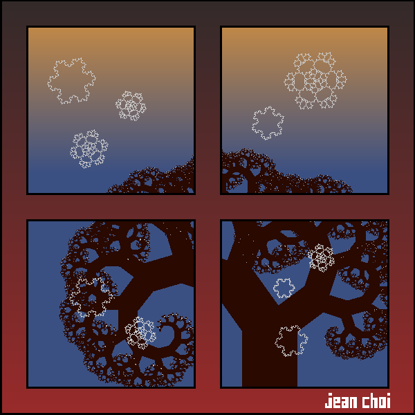
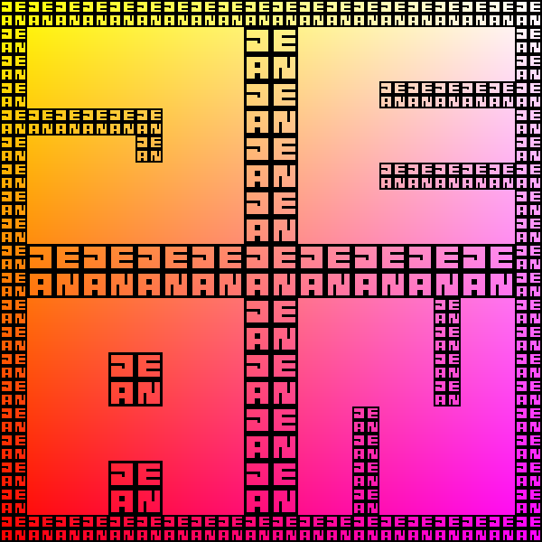
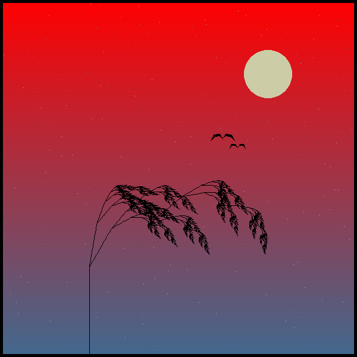
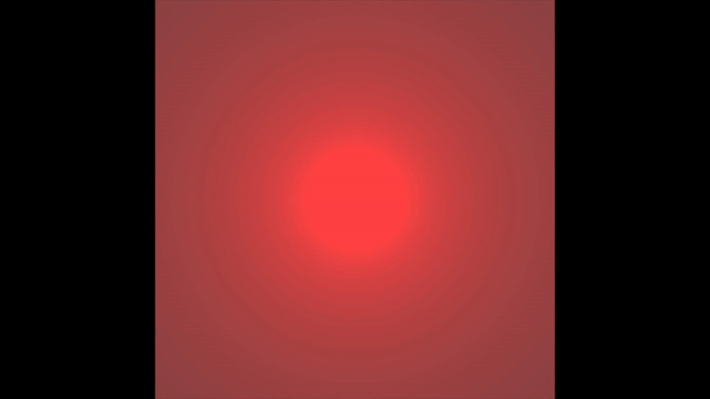
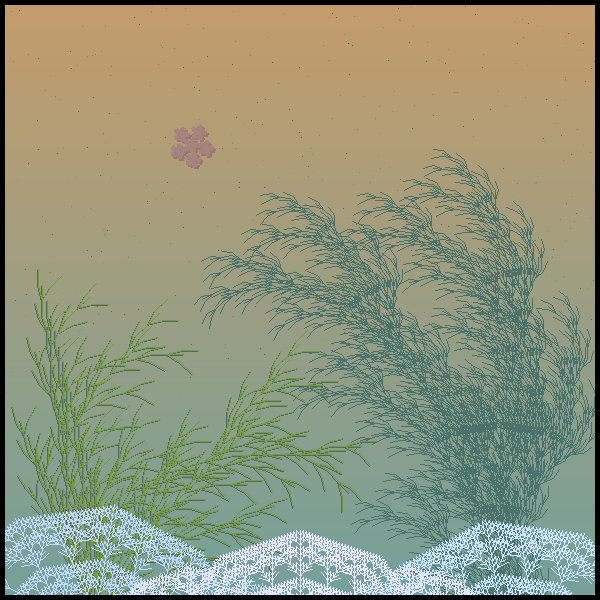

<!-- omit in toc -->
# Exploring Fractals

This repository contains all my course materials for the class CS410P Exploring Fractals, taught by Dr. David Ely at Portland State University during Summer 2020. You can read the final portfolio [here](FractalPortfolio.pdf).

<!-- omit in toc -->
## Table of Contents 📖

- [Final Portfolio Images ✨](#final-portfolio-images-)
  - ["Koch Winter"](#koch-winter)
  - ["I'd like a Mai Tai, please"](#id-like-a-mai-tai-please)
  - ["Drought"](#drought)
  - ["Multibrot"](#multibrot)
  - ["Beach"](#beach)
- [Technologies ⚙️](#technologies-️)
- [Authors ✍](#authors-)

## Final Portfolio Images ✨

### "Koch Winter"

  

### "I'd like a Mai Tai, please"

  

### "Drought"

  

### "Multibrot"

  

### "Beach"

  

## Technologies ⚙️

- C programming language
- [repl.it](https://repl.it/)
- [XQuartz](https://www.xquartz.org/)

## Authors ✍

Jean Choi

Dr. David Ely
